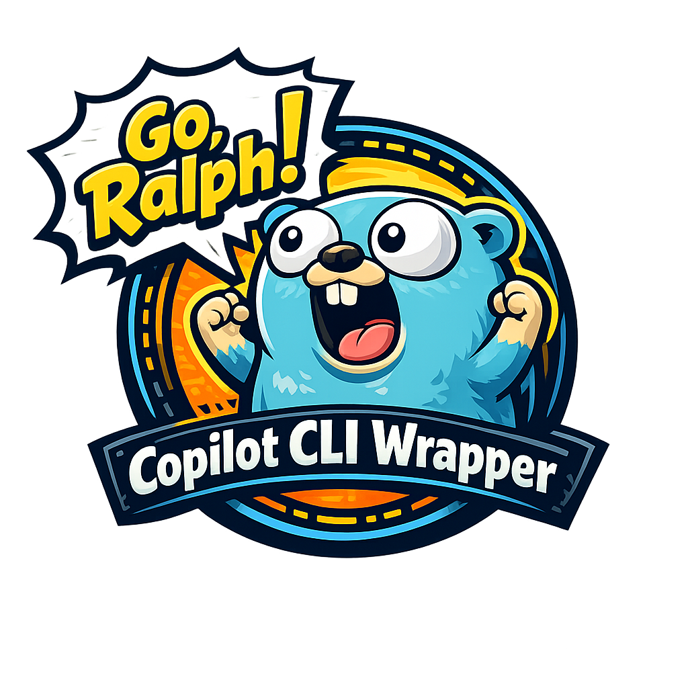

# Goralph

A Go wrapper to run the infamous [Ralph Wiggums][3] loop using [GitHub Copilot CLI][4].

## About

Goralph automates AI-assisted coding by running GitHub Copilot CLI in a loop until a task is complete. It reads a PRD (Product Requirements Document), builds a prompt, and repeatedly invokes Copilot until it signals completion or max iterations is reached.

## Prerequisites

- [go][1]
- [GitHub Copilot CLI][4]
- Optional: [Task][2]

## Installation

1. Download the latest binary for your platform from [Releases][5]

## Configuration

Edit the **.config.json** file in project root directory to configure the following settings:

| Setting | Description | Note |
| --- | --- | --- |
| prd | Path to the PRD JSON file | e.g. `./prd.json` |
| progress | Path to the progress file | e.g. `./progress.txt` |
| prompt | Path to the prompt template | e.g. `./prompt.txt` |
| model | Copilot model to use | e.g. `claude-haiku-4.5` |
| maxIterations | Maximum loop iterations | Prevents infinite runs |
| tools.allow | List of allowed Copilot tools | e.g. `["write", "shell(git:*)"]` |
| tools.deny | List of denied Copilot tools | e.g. `["shell(rm -rf *)"]` |
| logLevel | Set the logging level | Defaults to `info` |

## Usage

1. Create a PRD file with tasks to complete
1. Run Ralph

Ralph will loop until Copilot responds with `<promise>COMPLETE</promise>` or max iterations is reached.

## Troubleshooting

### Could not load config

Check config.json path and JSON syntax

### Could not load PRD

Verify the prd path in config.json

### Empty Copilot response

Check tool permissions and ensure at least one tool is allowed

### Max iterations reached

Increase `maxIterations` or simplify your PRD tasks

## Contributing

Check out [CONTRIBUTING.md](Contributing.md) for further information.

[1]: https://go.dev/
[2]: https://taskfile.dev/
[3]: https://x.com/mattpocockuk/status/2007924876548637089
[4]: https://github.com/features/copilot/cli/
[5]: (https://github.com/slangenbach/goralph/releases
